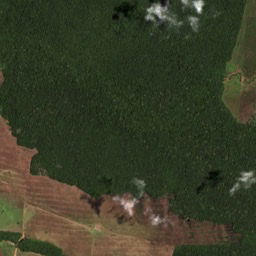
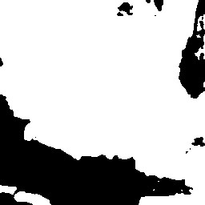
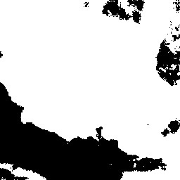
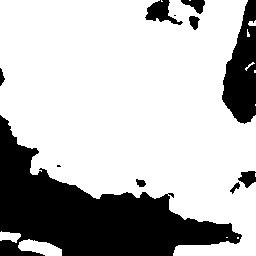
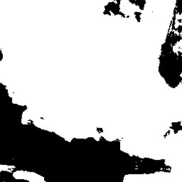
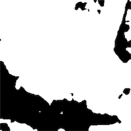
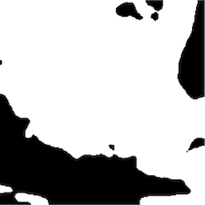

# Deep Learning Deforestation Detection

This repository contains the resources associated with my final project for the ST456 Deep Learning course at the London School of Economics, which I completed jointly with Rick Holubec and Chayenne Mosk. Our work focuses on identifying and tracking deforestation in the Amazon Rainforest using state-of-the-art deep learning models and multispectral satellite imagery.

## Structure

The repository is organized as follows:

- `data`: Contains subfolders for different steps in the data processing pipeline.
- `paper`: Contains our research paper.
- `scripts`: Contains various scripts for data processing, model creation, and evaluation.
- `sample`: Contains sample results.

## Findings

Our study finds that in this setting, simple models using the FCN and U-Net architectures outperformed more complex ones, such as the SegNet, Attention U-Net, and DeepLabV3+ models, in terms of accuracy. This illustrates the continued effectiveness of simple models for image segmentation tasks in the context of satellite imagery, despite recent advances in segmentation models generally. We were not able to successfully fine tune the new Segment Anything Model for our purposes.

### Results table

| Model               | Validation data IoU | Validation data Precision | Validation data Recall | Validation data F1-Score | Test data IoU | Test data Precision | Test data Recall | Test data F1-Score |
|---------------------|---------------------|---------------------------|------------------------|--------------------------|---------------|---------------------|------------------|--------------------|
| FCN                 | 0.9553              | 0.9708                    | **0.9836**             | 0.9772                   | 0.9447        | 0.9620              | **0.9814**       | 0.9716             |
| U-Net               | **0.9617**          | **0.9839**                | 0.9771                 | **0.9805**               | **0.9572**    | **0.9815**          | 0.9747           | **0.9781**         |
| SegNet              | 0.9058              | 0.9619                    | 0.9395                 | 0.9505                   | 0.9028        | 0.9518              | 0.9461           | 0.9489             |
| Attention U-Net     | 0.9579              | 0.9777                    | 0.9793                 | 0.9785                   | 0.9474        | 0.9682              | 0.9778           | 0.9730             |
| DeepLabV3+ ResNet50 | 0.9334              | 0.9827                    | 0.9490                 | 0.9656                   | 0.9184        | 0.9361              | 0.9799           | 0.9575             |
| DeepLabV3+ Xception (3 bands) | 0.9135   | 0.9679                    | 0.9421                 | 0.9548                   | 0.9014        | 0.9641              | 0.9328           | 0.9481             |
| DeepLabV3+ Xception (4 bands) | 0.9265   | 0.9649                    | 0.9588                 | 0.9618                   | 0.9235        | 0.9618              | 0.9586           | 0.9602             |

### Predictions

The actual and predicted deforested areas are shown on a test set satellite image. The biggest differences can be seen on the right-hand-side of the picture.

|       •                 |                •         |               •         |             •            |
|:----------------------:|:-----------------------:|:----------------------:|:-----------------------:|
|  |  |  |  |
| Image       | Ground Truth Label  | FCN Prediction     | SegNet Prediction  |
|  |  |  |  |
| U-Net Prediction  | Attention U-Net Prediction | DeepLabV3+ with ResNet50 Prediction | DeepLabV3+ with 4-band Xception Prediction |

## Data

For this project, we used the dataset containing 619 4-band satellite images from the Brazilian Amazon rainforest made available by [Bragagnolo, Lucimara, da Silva, Roberto Valmir, & Grzybowski, José Mario Vicensi (2021)](https://doi.org/10.5281/zenodo.4498086). 

## Contributions

As stated above, this project was completed jointly with Rick Holubec and Chayenne Mosk. Our paper includes this statement about our individual contributions:

>All authors contributed equally to the research question formulation and data sourcing. All authors contributed to the determination of the analytical framework and methods. All authors completed independent exploratory data analyses. All authors contributed to the evaluation framework used. All authors contributed to the processing and augmentation script used.
>- Mosk: implemented FCN, SegNet and Attention U-Net
>- Eliason: implemented tiling function, data saving and loading function, CNN (discarded after preliminary analysis), U-Net without attention, SAM fine-tuning experiment
>- Holubec: implemented DeepLabV3+ model with mul- tiple backbones and input shapes, worked on model fine-tuning and optimal model selection (ModelCheck- point, EarlyStopping)
